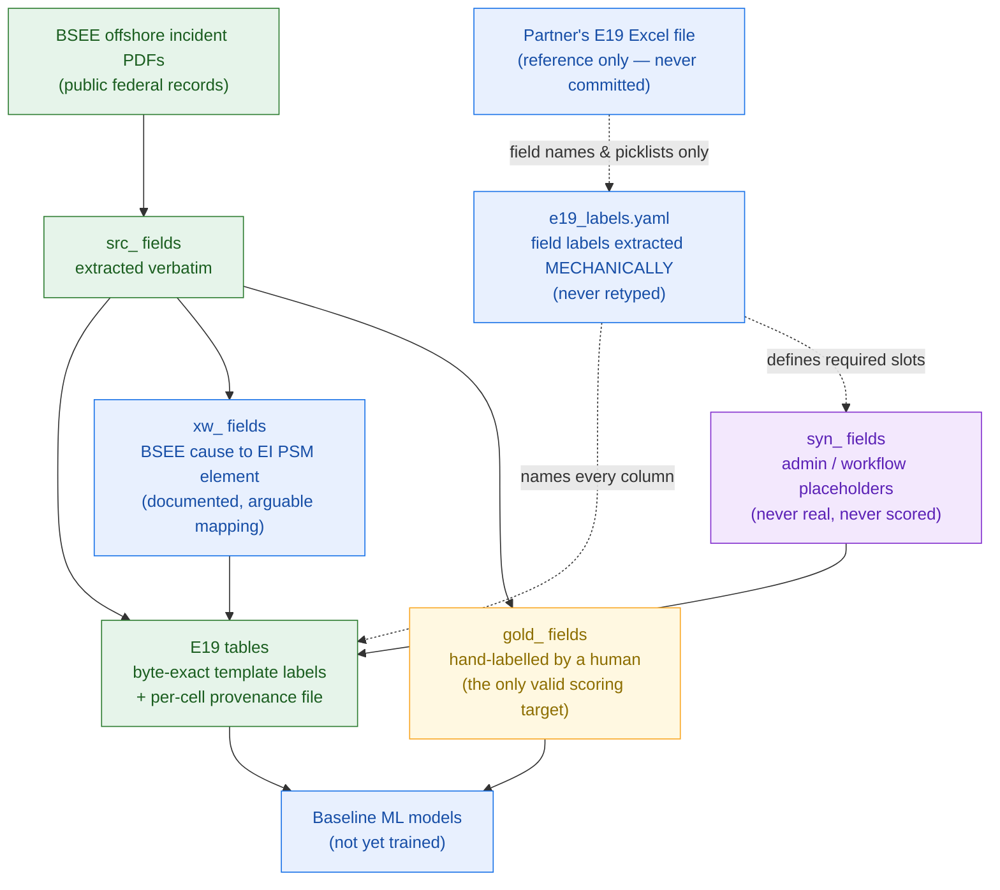

# psm-incident-ml

A public, reproducible dataset and baseline models for **process-safety incident
investigation** ML, built from US federal offshore incident reports published by
the Bureau of Safety and Environmental Enforcement (**BSEE**).

Records are mapped toward the Energy Institute PSM Framework **Element 19**
(Incident Reporting & Investigation) investigation-report structure.

> **Status: Stage 1 — data acquisition and vocabulary induction. No models yet.**
> Numbers marked _(pending)_ below are filled in by the pipeline, not by hand.

---

## How this fits together



**Read it as:** real BSEE reports flow in as `src`; a documented, arguable
mapping turns some of that into `xw`; where the E19 structure needs
administrative fields BSEE doesn't publish, we generate clearly-labelled `syn_`
placeholders; and a human labeller produces `gold_`, the only thing any model is
ever scored against.

The field labels are **extracted from the workbook mechanically, never retyped** —
every name mismatch found in review came from a human transcribing them, so
`psm.e19_schema` reads the labels and `psm.project` uses them at runtime. The E19
Excel file supplies names and picklists only. It is never a data source and is
never committed.

## What is real and what is generated

This is the first thing to read. The project deliberately mixes verbatim source
data, deterministic derivations, model output, and fully synthetic filler — and
**every column name says which it is.**

| Prefix  | Origin | Real? | May you score against it? |
|---------|--------|-------|---------------------------|
| `src_`  | Extracted verbatim from a BSEE PDF or CSV | **Real** — traceable to a source document | It is the input, not a label |
| `xw_`   | Deterministic crosswalk from a `src_` field via [`schema/crosswalk.yaml`](schema/crosswalk.yaml) | **Derived** — reproducible, but encodes an opinion | Only as a baseline to beat |
| `llm_`  | Assigned by a language model | **Not ground truth** | **No. Never.** |
| `gold_` | Assigned by a human annotator | **Real** — hand-labelled | **Yes — this is the only valid target** |
| `syn_`  | Fully generated administrative wrapper | **Not real.** Corresponds to nothing | No |

Concretely:

| Artifact | Status |
|---|---|
| `data/manifest.csv` — URLs + SHA256 of every source PDF | **Real**, committed, verifiable |
| `data/processed/investigations_index.csv` — BSEE structured listing | **Real**, committed |
| `data/raw/` — the PDFs themselves | **Real**, gitignored, rebuildable from the manifest |
| `data/processed/e19/*.csv` — the E19 tables, verbatim only | **Real** (`src`) |
| `data/processed/e19/enriched/*.csv` — the same tables with crosswalked values filled in | **Real** + **derived**; `enriched/provenance.csv` marks every cell `src` or `xw` |
| `data/processed/e19/bsee_unmapped.csv` — BSEE data with no E19 home | **Real** (`bsee_*`) |
| `gold/gold_labels.csv` — evaluation-set scaffold, 100 reports stratified 2003–2026 | `src_*` reference columns are **real**; `gold_*` columns are **blank, not yet hand-labelled**. See [`docs/findings.md`](docs/findings.md) (2026-08-09) |
| Administrative / workflow fields (reporter names, approval chain, agreed dates, recommendation tracking) | **Synthetic** (`syn_`) — the E19 template needs them; BSEE does not publish them. See [`docs/_synth.md`](docs/_synth.md) |
| **Risk-matrix fields** (consequence, likelihood, risk score, incident classification) | **Derived (`xw`), not synthetic.** An earlier version of this table called them `syn_`; that was wrong and `enriched/provenance.csv` always said `xw`. They are computed from real BSEE fields — hazard type, operation checkboxes, damage amount — through [`schema/xw_consequence_tiers.yaml`](schema/xw_consequence_tiers.yaml). Reproducible, and an opinion. |

**Why any synthetic data at all?** The E19 investigation-report structure
includes administrative and risk-scoring fields (who reported it, internal
tracking IDs, sign-off chains, severity/risk-matrix scores) that BSEE reports
do not contain and that no public source provides. Those are generated by
[`src/psm/synth.py`](src/psm/synth.py) from documented, deterministic rules in
[`schema/synth_rules.yaml`](schema/synth_rules.yaml) — see
[`docs/_synth.md`](docs/_synth.md) for the plain-language version. They are
never used as features or labels, and they are always `syn_`-prefixed.

## Known bias: the worst outcomes are thinned

**Read this before drawing any severity-weighted conclusion.**

BSEE convenes a *panel* investigation for death, serious injury or significant
pollution, and issues a *district* report otherwise. The two are structurally
different documents. This pipeline was built against the district form
(MMS Form 2010); of 61 panel reports, 57 fail to parse and the 4 that do produce
near-empty rows, so panel reports are **excluded**.

That exclusion is correct on parsing grounds and wrong on sampling grounds,
because panel reports *are* the high-severity tail:

| Accident type | in the BSEE index | panel | share |
|---|---|---|---|
| **Fatality** | 85 | 46 | **54.1%** |
| Blowout | 58 | 18 | 31.0% |
| Explosion | 74 | 5 | 6.8% |
| Pollution | 436 | 16 | 3.7% |
| Fire | 514 | 10 | 1.9% |
| Crane | 197 | 3 | 1.5% |

**Over half of all fatality investigations are missing from this dataset.** Three
`Injury Fatality` records reach the output against 85 in the index; panel
exclusion accounts for 46, and roughly 37 remain unexplained
([`docs/findings.md`](docs/findings.md)). Any model trained here learns from a
corpus with its worst outcomes systematically removed.

## Provenance is per cell, not per column name

The E19 tables are the one place the prefix convention above does **not** apply,
and deliberately so. Their columns must carry the source workbook's field labels
byte-exact — including its own irregularities (`Incident Classificatioin`,
` Failed PSM Framework Element` with a leading space, `What happened?  ` with
trailing spaces) — so a prefix would break the exactness guarantee the projection
layer exists to provide.

Provenance therefore moves to a **parallel file of identical shape**, every cell
holding `src`, `xw` or empty:

```
enriched/incidents.csv          the values, under exact E19 labels
enriched/provenance.csv         same shape; per-cell src / xw / empty
enriched/causes_provenance.csv
enriched/causes_confidence.csv  per-cell confidence where a mapping is graded
```

This is stronger than a prefix: a prefix labels a whole column, while the
parallel file labels every cell — and the same E19 column is read verbatim on one
row and inferred on another. `tests/test_conventions.py` enforces both halves,
including that a crosswalked value **never overwrote a verbatim one**.

## The reproducibility contract

`data/raw/` is gitignored — the repo does not redistribute BSEE PDFs. Instead
`data/manifest.csv` is **committed** with a SHA256 per file. From a fresh clone
you can rebuild byte-identical inputs and verify you got what we got:

```bash
uv run python -m psm.harvest && uv run python -m psm.fetch && uv run python -m psm.extract
```

If a SHA mismatches, the pipeline says so loudly rather than proceeding.

## Data sources and licensing

See **[DATA_SOURCES.md](DATA_SOURCES.md)** for per-source provenance, retrieval
dates, and licence basis.

- **Code** in this repo is MIT licensed (see [LICENSE](LICENSE)).
- **Source data** carries its own terms, documented per source in `DATA_SOURCES.md`.
- The Energy Institute PSM Framework is referenced for its element structure;
  no EI publication or workbook is reproduced here.

## Findings

The running verification log — including the induced cause vocabulary, where the
report-typing boundary actually falls, and extraction failure rate by year —
lives in **[docs/findings.md](docs/findings.md)**, as dated append-only entries.

## Repo layout

```
schema/     e19_target.yaml   target schema (hand-written, no workbook)
            bsee_form2010.yaml  source field map incl. bbox hints
            crosswalk.yaml    BSEE cause -> E19. Versioned, human-readable, arguable
src/psm/    harvest -> fetch -> extract -> causes -> crosswalk -> synth
data/       manifest.csv (committed) | raw, interim (gitignored) | processed (committed)
gold/       hand-labelled evaluation set
docs/       findings.md — dated verification log
```

## Contributing / arguing with us

The crosswalk in `schema/crosswalk.yaml` is an **opinion** about how BSEE cause
categories map onto EI PSM elements. It is deliberately kept in one readable
screen of YAML so you can disagree with it in a pull request. If you think a
mapping is wrong, that is the file to change — not the Python.
